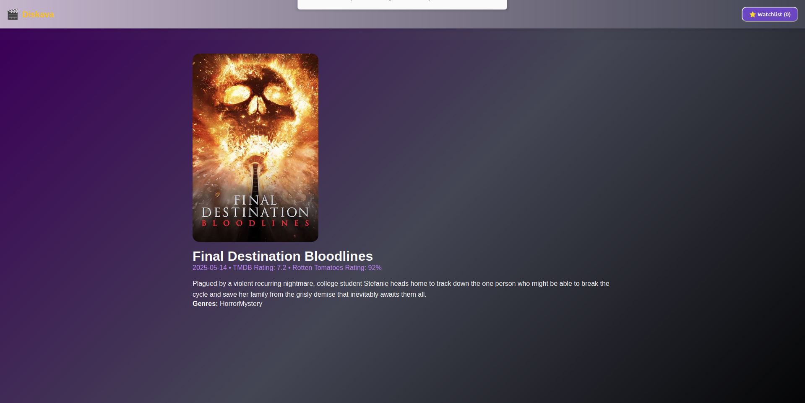
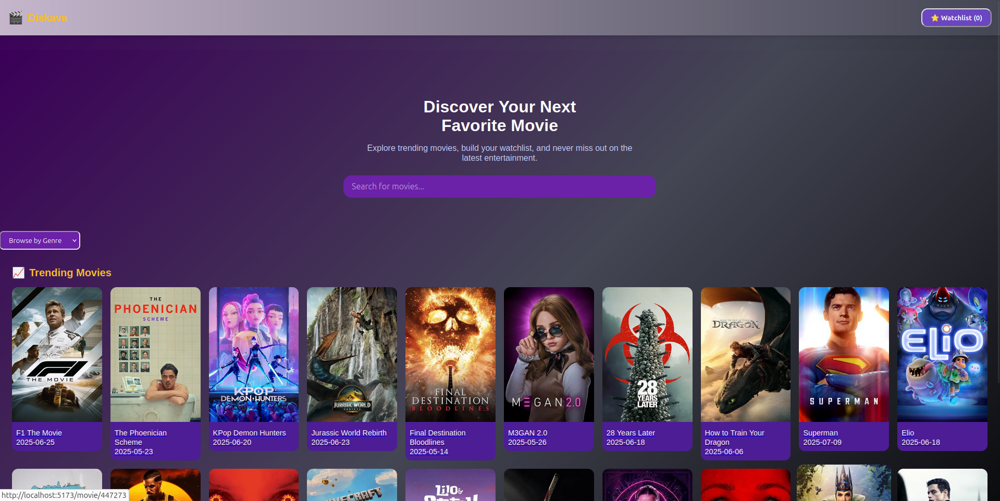

# 🎬 Movie & TV Show Explorer

A responsive web app for discovering movies and TV shows, managing watchlists, and exploring trending content using public APIs like TMDB and OMDB.

---

## ✅ Project Overview

This full-featured application is designed to help users discover, explore, and manage their engagement with movies and TV shows. Built with performance, usability, and extensibility in mind, it leverages real-time search, detailed media information, persistent watchlist management, and trending recommendations.

### 🔧 Primary Features
- Real-time movie/TV show search with debounce
- Trending movies & TV shows
- Filter by genre
- Watchlist management (localStorage)
- Detailed view of selected media
- Responsive design for all screen sizes
- Clean UX with loading states, error handling, and transitions

---

## 🛠️ MVP Definition

The Minimum Viable Product includes the following core features:
- [x] Search movies/TV shows (real-time, debounced)
- [x] View basic info: title, plot, poster, release date
- [x] Add/remove from watchlist (persisted via `localStorage`)
- [x] Browse trending movies/shows
- [x] Filter by genre

Excluded from MVP but planned for future iterations:
- Multi-source ratings (e.g., OMDB integration)
- Watch provider filters (Netflix, Amazon, etc.)
- Social sharing / trailer embeds
- Export watchlist as PDF or CSV

---

## 🚀 Setup Instructions

1.  Clone the repository:

    ```bash
    git clone https://github.com/your-username/ma_muvi.git
    ```
2.  Install the dependencies:

    ```bash
    npm install
    ```
3.  Create a `.env` file in the root directory and add your TMDB API key:

    ```
    VITE_TMDB_API_KEY=your_tmdb_api_key
    ```
4.  Run the development server:

    ```bash
    npm run dev
    ```

---

## 📸 Screenshots





---

## ⚙️ API Documentation

### TMDB API

The application uses the TMDB API to fetch movie and TV show data.

*   **Trending Movies:** [`src/lib/api/tmdb.ts`](src/lib/api/tmdb.ts)
    ```typescript
    export const getTrendingMovies = async () => {
      const res = await client.get('/trending/movie/week');
      return res.data.results;
    };
    ```
*   **Trending TV Shows:** [`src/lib/api/tmdb.ts`](src/lib/api/tmdb.ts)
    ```typescript
    export const getTrendingTVShows = async () => {
      const res = await client.get('/trending/tv/week');
      return res.data.results;
    };
    ```

### OMDB API

The application uses the OMDB API to fetch additional movie data.

*   **Get Movie Details:** [`src/lib/api/omdb.ts`](src/lib/api/omdb.ts)
    ```typescript
    export const getMovieDetails = async (id: string) => {
      const res = await client.get(`/?i=${id}&apikey=${API_KEY}`);
      return res.data;
    };
    ```
---
